# Seat Reservation module dependencies — accepted design

This diagram shows new or changed application modules in the accepted design,
plus their direct dependencies and dependents. Arrows point from a module to a
module it imports or uses. Existing edges are checked against current source;
new-module edges describe the planned boundaries.

Unchanged neighbors are included only when directly connected to a new or changed
module; their own dependencies are not expanded. Common `std`, `aws` configuration,
Lambda runtime and test-only imports are omitted. Build scripts, shell wrappers,
cloud resources and runtime message flow are outside this source-module view.

```mermaid
flowchart TB
    subgraph NEW["New modules"]
        Submit["seat_reservation_processor.zig"]
        Complete["seat_reservation_completion_processor.zig"]
        Seat["seat_reservation.zig"]
        Persist["seat_reservation_persistence.zig"]
        Counter["ledger_counter.zig"]
        EventsCLI["seat_events_cli.zig"]
        CounterCLI["ledger_counter_cli.zig"]
    end

    subgraph CHANGED["Changed existing modules"]
        Message["processor_message.zig"]
        OpPersist["operation_persistence.zig"]
        Intake["intake_lambda.zig"]
        Native["tiger_beetle_processor.zig"]
        Generic["tiger_beetle_completion_processor.zig"]
        QueueCLI["queue_cli.zig"]
    end

    subgraph NEIGHBORS["Unchanged direct dependencies / dependents"]
        Operation["operation.zig"]
        Queue["sqs_queue.zig"]
        Auth["lambda_auth.zig"]
        TB["tigerbeetle.zig"]
        Query["query_lambda.zig"]
        PersistenceCLI["persistence_cli.zig"]
        Dynamo["dynamodb SDK module"]
    end

    Submit --> Seat
    Submit --> Persist
    Submit --> Counter
    Submit --> Message
    Submit --> Queue
    Complete --> Seat
    Complete --> Persist
    Complete --> Message
    EventsCLI --> Seat
    EventsCLI --> Persist
    CounterCLI --> Counter
    Persist --> Seat
    Persist --> OpPersist
    Persist --> Dynamo
    Counter --> Dynamo
    Seat --> Operation

    Message --> Operation
    OpPersist --> Operation
    OpPersist --> Dynamo
    Intake --> Message
    Intake --> OpPersist
    Intake --> Operation
    Intake --> Queue
    Intake --> Auth
    Native --> Message
    Native --> Operation
    Native --> Queue
    Native --> TB
    Generic --> Message
    Generic --> OpPersist
    Generic --> Operation
    QueueCLI --> Message
    QueueCLI --> Operation
    QueueCLI --> Queue

    Query --> OpPersist
    PersistenceCLI --> OpPersist
```

`query_lambda.zig` and `persistence_cli.zig` appear because they directly depend on
changed `operation_persistence.zig`; their production behavior is unchanged.
The native processor uses the shared envelope but does not depend on seat modules.

See the [final handoff](.scratch/seat-reservation/comments/seat-handoff/2026-09-27-resolution.md) for responsibilities and implementation order.
