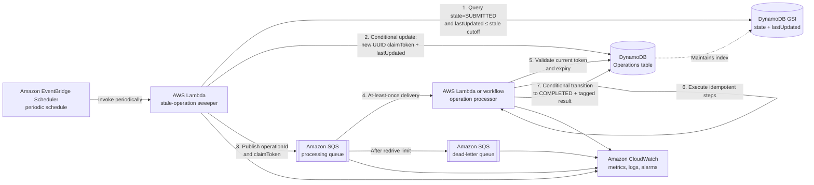

# Stale Operation Retry Service

## Summary

This proposal defines an AWS serverless service that periodically finds stale operations in DynamoDB and resubmits them for asynchronous processing until they expire.

An operation follows this state machine:

```text
SUBMITTED ──► COMPLETED
               ├── SUCCESS result
               └── FAILURE result
```

Completion outcome is carried by a tagged `result` envelope rather than by a
separate lifecycle state. The envelope is
`{"type":"SUCCESS|FAILURE","payload":<non-null JSON>}`; the complete compact
envelope is bounded to 4,096 bytes.

Processing is deliberately **at least once**. Every asynchronous step must therefore remain idempotent. A UUID claim token identifies the current dispatch generation and prevents an older worker from continuing or completing an operation after a newer retry has claimed it.

The design intentionally uses:

- No DynamoDB write sharding.
- No worker heartbeats or leases.
- The existing `lastUpdated` field for stale-operation detection.
- A single `expiresAt` field for both the processing deadline and DynamoDB TTL.
- No persisted attempt counter; `expiresAt` bounds retry activity.

## Architecture and processing flow



The sequence numbers in the diagram correspond to the detailed flow below.

## Components

| Component | Responsibility |
|---|---|
| EventBridge Scheduler | Invokes the sweeper at a fixed interval, such as once per minute. Scheduler retries and a scheduler DLQ protect the periodic trigger. |
| Sweeper Lambda | Queries stale `SUBMITTED` operations, atomically installs a new UUID claim token, and publishes successfully claimed operations to SQS. |
| Operations table | Remains the source of truth for operation state, ownership, freshness, and expiry. |
| State/lastUpdated GSI | Supports an efficient query for stale `SUBMITTED` operations without scanning the table. |
| SQS processing queue | Buffers resubmissions and provides at-least-once delivery to the processor. |
| Processor | Validates the claim token, executes idempotent steps, and performs the completion transition. |
| SQS DLQ | Captures messages that repeatedly fail at the queue-consumer layer. It is an operational signal, not a terminal operation state. |
| CloudWatch | Records service metrics and logs and raises alarms for stalled or failing retry processing. |

## DynamoDB data model

The Operations table contains the following relevant attributes:

| Attribute | Type | Purpose |
|---|---|---|
| `operationId` | String | Table partition key and stable idempotency identifier. |
| `state` | String | `SUBMITTED` or `COMPLETED`. |
| `lastUpdated` | Number or sortable string | Timestamp of the most recent operation mutation or retry claim. Used to determine staleness. |
| `expiresAt` | Number | Unix epoch time in seconds. Used as both the logical processing deadline and DynamoDB TTL attribute. |
| `claimToken` | String | UUID identifying the most recently claimed dispatch generation. Present while the operation remains `SUBMITTED`. |
| `result` | String, optional | Present only for `COMPLETED`; complete compact tagged envelope containing success, definitive business failure, or expiry information. |

No `attemptCount`, `leaseUntil`, `lastProgressAt`, `deleteAfter`, or shard attribute is introduced.

### Global secondary index

Create the following GSI:

```text
Index name: OperationsByStateAndLastUpdated
Partition key: state
Sort key: lastUpdated
Projection: operationId, expiresAt, claimToken
```

The sweeper queries only the `SUBMITTED` partition. Completed operations move
to the single `COMPLETED` index partition when their state changes and are no
longer retry candidates. There is no sharding of the `SUBMITTED` partition in
this design.

DynamoDB GSIs are eventually consistent. The GSI is therefore only a candidate-discovery mechanism; correctness comes from conditional updates against the base table.

## Configuration

The service has two important timing values:

- `scheduleInterval`: how often EventBridge invokes the sweeper.
- `staleThreshold`: how long a `SUBMITTED` operation may remain unchanged before it is eligible for resubmission.

Because workers do not emit heartbeats, `staleThreshold` must exceed the expected maximum time for a healthy processing attempt. Otherwise, a still-running attempt may be superseded and fenced by a new claim token.

Approximate worst-case stale detection latency is:

```text
staleThreshold
+ scheduleInterval
+ GSI propagation delay
+ SQS delivery delay
```

## Detailed processing flow

### 1. Create and initially dispatch an operation

The initial dispatcher creates the operation with:

```text
state       = SUBMITTED
lastUpdated = now
expiresAt   = business deadline in epoch seconds
claimToken  = newly generated UUID
result      = absent
```

It then publishes `{ operationId, claimToken }` to the processing queue. Using the same token protocol for initial dispatch and retries gives every worker identical fencing behavior.

If the initial publisher fails after writing DynamoDB but before publishing to SQS, the operation eventually becomes stale and is recovered by the sweeper.

### 2. Find stale operations

On every scheduled invocation, the sweeper calculates:

```text
staleCutoff = now - staleThreshold
```

It paginates through this GSI query:

```text
state = "SUBMITTED" AND lastUpdated <= staleCutoff
```

The Lambda should stop before its execution timeout and allow the next scheduled invocation to continue draining any backlog. Query page size and reserved concurrency should protect the Operations table and downstream queue from sudden bursts.

### 3. Claim a stale operation

For each candidate, the sweeper generates a fresh UUID and sends a conditional `UpdateItem` to the base table.

Conceptually:

```text
ConditionExpression:
    state = :submitted
    AND lastUpdated <= :staleCutoff
    AND expiresAt > :currentEpochSecond

UpdateExpression:
    SET claimToken = :newClaimToken,
        lastUpdated = :now
```

`expiresAt` is used only as a deadline check. Its one-second granularity is not used for claim identity or mutual exclusion.

The UUID provides generation identity. Updating `lastUpdated` in the same atomic operation removes the item from the stale time range. If two sweeper invocations race, the first successful update advances `lastUpdated`; subsequent conditional claims using the old stale cutoff fail.

The new token deliberately replaces any token belonging to the stale attempt.

### 4. Publish the retry

Only after the conditional claim succeeds does the sweeper publish to SQS:

```json
{
  "operationId": "op-123",
  "claimToken": "550e8400-e29b-41d4-a716-446655440000"
}
```

If `SendMessage` fails, the operation remains `SUBMITTED` with its updated `lastUpdated`. It becomes stale again after another `staleThreshold`, receives a new UUID, and is retried. No rollback is required.

### 5. Validate ownership and expiry

Before executing work, the processor performs a strongly consistent read of the base-table item and verifies:

```text
state = SUBMITTED
claimToken = message.claimToken
expiresAt > currentEpochSecond
result is absent
```

The processor must reject the message without performing side effects when any check fails.

The token should also be checked with a strongly consistent base-table read before starting each asynchronous step. These checks are fencing checks, not heartbeats: they do not extend the attempt, update `lastUpdated`, or change the expiry.

### 6. Execute idempotent steps

Each step uses a stable idempotency key derived from the operation and step, for example:

```text
operationId + stepName
```

This remains necessary because SQS and Lambda event-source mappings provide at-least-once processing. Duplicate deliveries of the same SQS message carry the same UUID and are not distinguished by generation fencing.

There are no periodic heartbeat writes. Normal business mutations may update `lastUpdated`, but the processor does not write merely to signal liveness.

### 7. Perform the completion transition

Successful processing performs a conditional update equivalent to:

```text
ConditionExpression:
    state = :submitted
    AND claimToken = :messageClaimToken
    AND expiresAt > :currentEpochSecond
    AND attribute_not_exists(result)

UpdateExpression:
    SET state = :completed,
        result = :successResult,
        lastUpdated = :now
    REMOVE claimToken
```

A successful result uses a non-null payload, for example
`{"type":"SUCCESS","payload":{"operation_id":"op-123"}}`. A non-retryable
business error uses the same condition, also transitions to `COMPLETED`, and
stores its classification inside a failure payload, for example
`{"type":"FAILURE","payload":{"code":"NON_RETRYABLE"}}`.

Transient infrastructure errors leave the operation in `SUBMITTED` without a
result. Once its unchanged `lastUpdated` crosses the stale cutoff, the sweeper
installs a new token and dispatches it again.

If the processor discovers that the deadline has passed, it must stop
processing. It may use a separate conditional update requiring `state =
SUBMITTED`, the matching claim token, `expiresAt <= currentEpochSecond`, and no
existing result to transition to `COMPLETED`, remove the token, and store
`{"type":"FAILURE","payload":{"code":"EXPIRED"}}`. No top-level failure
field is used.

Every completion condition requires the current state to remain `SUBMITTED`.
The first successful completion therefore wins, and a completed operation is
immutable even when a later worker proposes the same result.

## Claim-token semantics

The claim token is a fencing token, not an exactly-once mechanism.

- A retry overwrites the previous token with a new UUID.
- A delayed worker carrying an older token cannot start another step or perform a completion update.
- A worker already executing a step may finish that external call after being superseded; step-level idempotency makes that safe.
- Duplicate deliveries from the same dispatch carry the same UUID and may run concurrently. Idempotency and the conditional completion transition handle this case.

Since there are no heartbeats, a processing attempt should normally finish before `staleThreshold`. If it does not, the next retry becomes the authoritative generation and the older worker is fenced.

## Expiry and TTL semantics

`expiresAt` has two roles:

1. The logical cutoff after which the service must not begin or successfully complete more processing.
2. The DynamoDB TTL attribute used to remove the item.

All application checks compare the current epoch second with `expiresAt`. Ownership is always established by the UUID, never by the expiry timestamp.

DynamoDB TTL deletion is asynchronous and can occur after the configured timestamp rather than exactly at it. Therefore:

- The sweeper and processor must enforce the logical deadline themselves.
- An expired item may still exist temporarily and can be marked `COMPLETED`
  with an `EXPIRED` failure result.
- An expired item may be deleted before that terminal state is observed or retained.
- This design does not provide durable post-expiry operation history. Durable audit history would require a separate record or destination not governed by this TTL.

## Failure analysis

| Failure | Result and recovery |
|---|---|
| Scheduler temporarily fails to invoke the sweeper | EventBridge Scheduler retry policy retries the invocation; exhausted deliveries go to its DLQ and trigger an alarm. |
| Sweeper crashes before claiming | The operation remains stale and is found by a later sweep. |
| Two sweepers select the same GSI entry | Only one conditional claim advances `lastUpdated`; the other receives a conditional-check failure. |
| GSI returns an obsolete entry | The base-table conditional update rejects it if it is no longer stale, no longer `SUBMITTED`, or already expired. |
| Sweeper crashes after claiming but before publishing | The operation becomes stale again after `staleThreshold` and is claimed with a new UUID. |
| SQS delivers the same retry more than once | Step idempotency handles duplicates; the completion update remains conditional. |
| An old message arrives after a newer retry | Its UUID does not match the current token, so the worker discards it. |
| Worker crashes between steps | No heartbeat occurs. The operation becomes stale and is dispatched with a new token. |
| Worker runs longer than `staleThreshold` | A new retry may replace its token. The old worker must stop at its next token check and cannot perform the completion transition. |
| Processing repeatedly fails | Resubmission continues without an attempt counter until `expiresAt`. |
| A message reaches the processing DLQ | The operation remains `SUBMITTED`; the sweeper can resubmit it again until expiry. The DLQ raises an operational alarm. |
| Operation reaches its deadline | New claims fail, workers stop, and DynamoDB TTL eventually removes the record. If it still exists, it may first become `COMPLETED` with an `EXPIRED` failure result. |

## Queue configuration

Use an SQS standard queue because the application already tolerates duplicate and out-of-order processing through token validation and idempotent steps.

Recommended settings:

- Set the visibility timeout longer than the expected worker execution time.
- Configure a redrive policy and DLQ for unexpected consumer failures.
- Enable partial-batch responses on the Lambda event-source mapping so one failed message does not cause successful messages in the batch to be retried.
- Limit worker concurrency when downstream systems need protection from retry bursts.

The queue's DLQ does not replace the operation expiry policy. A message can reach the DLQ while its operation remains eligible for a later sweeper-driven redispatch.

## Observability

Publish the following CloudWatch metrics without persisting retry counters in the operation item:

- Number of stale candidates returned.
- Claims accepted and rejected.
- Retry messages published and publish failures.
- Token-mismatch discards.
- Expired operations observed.
- GSI query throttles and DynamoDB conditional-write throttles.
- SQS queue depth and age of oldest message.
- Processing DLQ depth.
- Sweeper and processor Lambda errors, throttles, duration, and concurrency.

Recommended alarms include:

- Scheduler DLQ contains a message.
- Processing DLQ contains a message.
- Queue age exceeds the expected processing objective.
- Sweeper has no successful invocations for multiple schedule intervals.
- Lambda or DynamoDB throttling persists.
- Oldest `SUBMITTED` operation age approaches the expiry window.

## Security and permissions

Apply least-privilege IAM roles:

- EventBridge Scheduler may invoke only the sweeper Lambda.
- The sweeper may query only the retry GSI, conditionally update the Operations table, publish to the processing queue, and write its logs and metrics.
- The processor may read and conditionally update operation items, consume from the processing queue, and invoke only the downstream services required by the operation.
- Encryption at rest should use the organization-standard AWS-managed or customer-managed KMS keys for DynamoDB, SQS, and logs.

Do not place credentials or the complete operation payload in SQS. The queue message should contain only identifiers and the UUID claim token; the processor loads authoritative data from DynamoDB.

## Delivery guarantees and limitations

The service provides:

- Periodic recovery of stale `SUBMITTED` operations without table scans.
- At-least-once resubmission until the operation expires.
- Atomic installation of a unique dispatch generation.
- Fencing of workers belonging to older generations.
- Bounded retry lifetime through `expiresAt`.
- Serverless scaling and managed failure handling.

It does not provide:

- Exactly-once processing.
- Durable operation history after TTL expiration.
- Protection from a single hot `SUBMITTED` GSI partition at arbitrarily large scale.
- Automatic extension for legitimately long-running attempts, because heartbeats and leases are intentionally excluded.

## AWS references

- [Amazon EventBridge Scheduler](https://docs.aws.amazon.com/eventbridge/latest/userguide/using-eventbridge-scheduler.html)
- [DynamoDB read consistency](https://docs.aws.amazon.com/amazondynamodb/latest/developerguide/HowItWorks.ReadConsistency.html)
- [DynamoDB condition expressions](https://docs.aws.amazon.com/amazondynamodb/latest/developerguide/Expressions.OperatorsAndFunctions.html)
- [DynamoDB time to live](https://docs.aws.amazon.com/amazondynamodb/latest/developerguide/TTL.html)
- [Using AWS Lambda with Amazon SQS](https://docs.aws.amazon.com/lambda/latest/dg/with-sqs.html)
- [Amazon SQS standard queues](https://docs.aws.amazon.com/AWSSimpleQueueService/latest/SQSDeveloperGuide/standard-queues.html)
